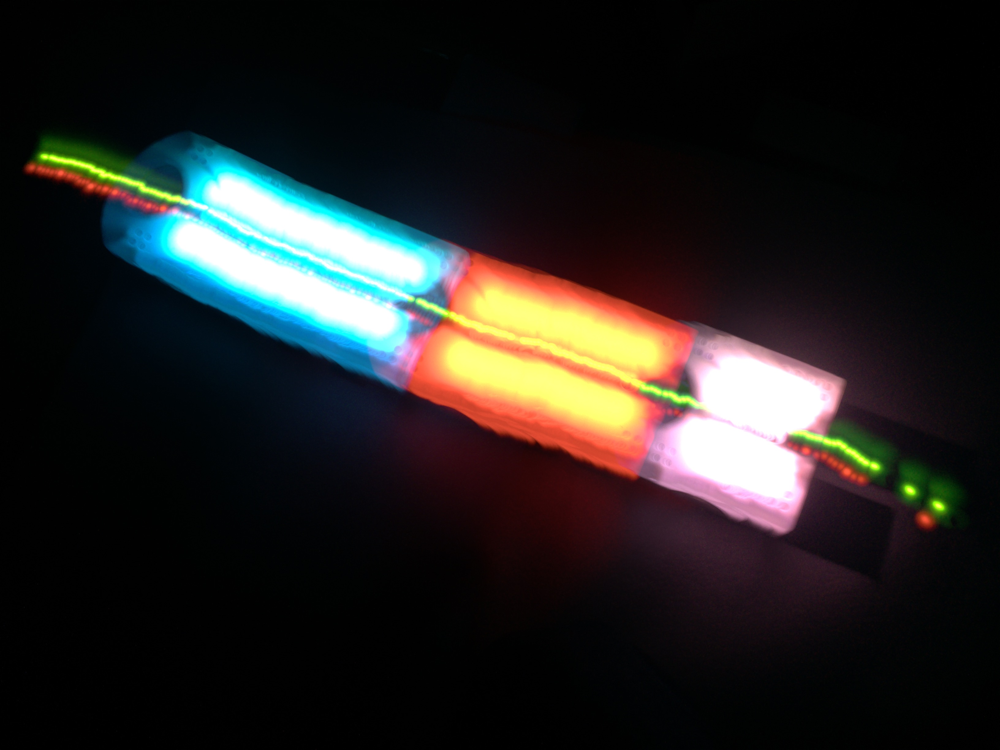
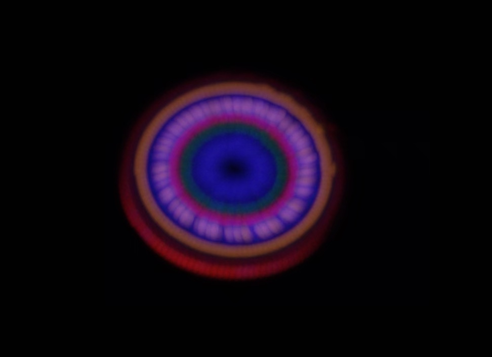

# Lichtmalerei

Lichtmalerei ist eine der beindruckendensten Möglichkeiten, die mit den Thymio-Robotern möglich sind.



Mit Thymio, einem Stativ und einer Kamera-App mit der Möglichkeit von Langzeitbelichtung auf einem Smartphone oder Tablet können sehr eindrucksvolle Lichtmalerei betrieben werden.

Im folgenden werden 5 verschiedene Möglichkeiten beschrieben, wie Lichtmalerei mit dem Thymio möglich ist:

1. [Lichtmalerei mit der Fernbedienung](lichtmalerei-mit-der-fernbedienung.md)
2. [Lichtmalerei mit Spuren](lichtmalerei-mit-spuren.md)
3. [Lichtmalerei mit VPL](lichtmalerei-mit-vpl.md)
4. [Lichtmalerei mit Aseba](lichtmalerei-mit-aseba.md)
5. [Lichtmalerei mit Barcodes](lichtmalerei-mit-barcodes.md)

