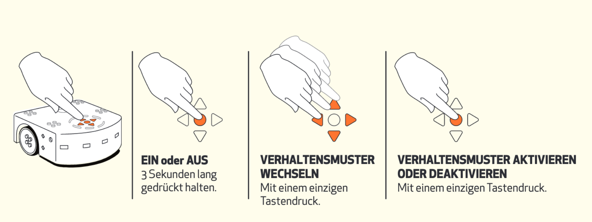

# Lichtmalerei mit der Fernbedienung

### Thymio einschalten

Am einfachsten lässt sich Lichtmalerei mit der Fernbedienung gestalten. Dazu musst Du nur folgende Anleitung beachten:

1. Stelle den Thymio mit der runden mittleren Taste auf seinem Rücken an.
2. Wechsle mit den Pfeiltasten \(rechts oder links\) in den Modus gehorsam.
3. Bestätige den Modus mit der runden Taste.

### Kamera aufbauen

Setze ein Tablet oder Smartphone in ein Stativ ein. Wähle den Abstand so, dass Du ausreichend Fläche hast, auf der der Thymio fahren kann ohne dass er aus dem Kamerabild herausfährt.

Starte eine Kamera-App die Langzeitbelichtungen unterstützt.

### Bilder aufnehmen

Bevor Du Dein Bild aufnimmst, solltest Du den Raum etwas abdunkeln. Bei manchen Kamera-Apps muss es nicht sehr dunkel sein, um gute Bilder aufzunehmen. Stattdessen kann die ISO-Empfindlichkeit reduziert werden.


**Aufgabe**

Wenn Du nun auf den Aufnahme-Knopf drückst, und den Thymio mit der Fernbedienung steuerst, kannst Du mit etwas Übung zum Beispiel deinen Namen schreiben.


Wenn Dich das leuchten der grünen Batterie-LED-Anzeige auf der Aufnahme stört, kannst Du diese einfach abkleben.

