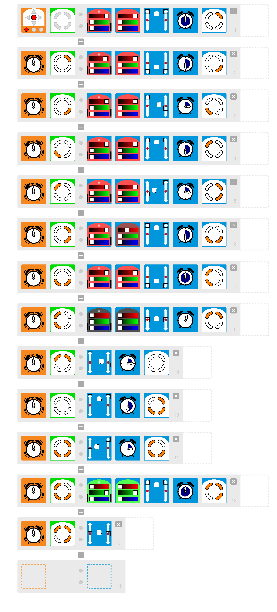
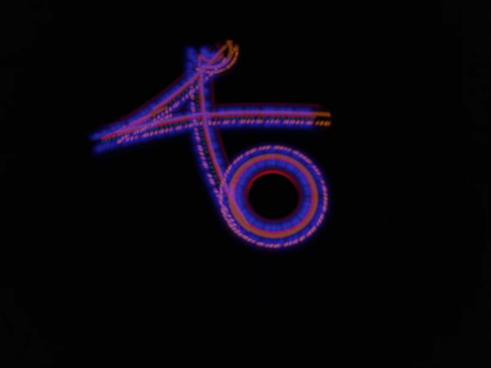

# Lichtmalerei mit VPL

### Programmcode analysieren

Starte das Programm Thymio VPL und programmiere folgenden Code:


**Aufgabe**

1. Baue alles so auf, wie es unter [Lichtmalerei mit der Fernbedienung](lichtmalerei-mit-der-fernbedienung.md) beschrieben wird und mache eine Aufnahme von Thymios Fahrweg. Alternativ kannst Du auch den Thymio mit einem Stift auf Papier fahren lassen. Findest Du heraus, was Thymio Dir sagen möchte?
2. Analysiere den Programmcode Zeile für Zeile und notiere Dir für jede Zeile, was sie bedeutet.
3. Programmiere ein eigenes Lichtkunstwerk oder lasse Thymio etwas schreiben.


