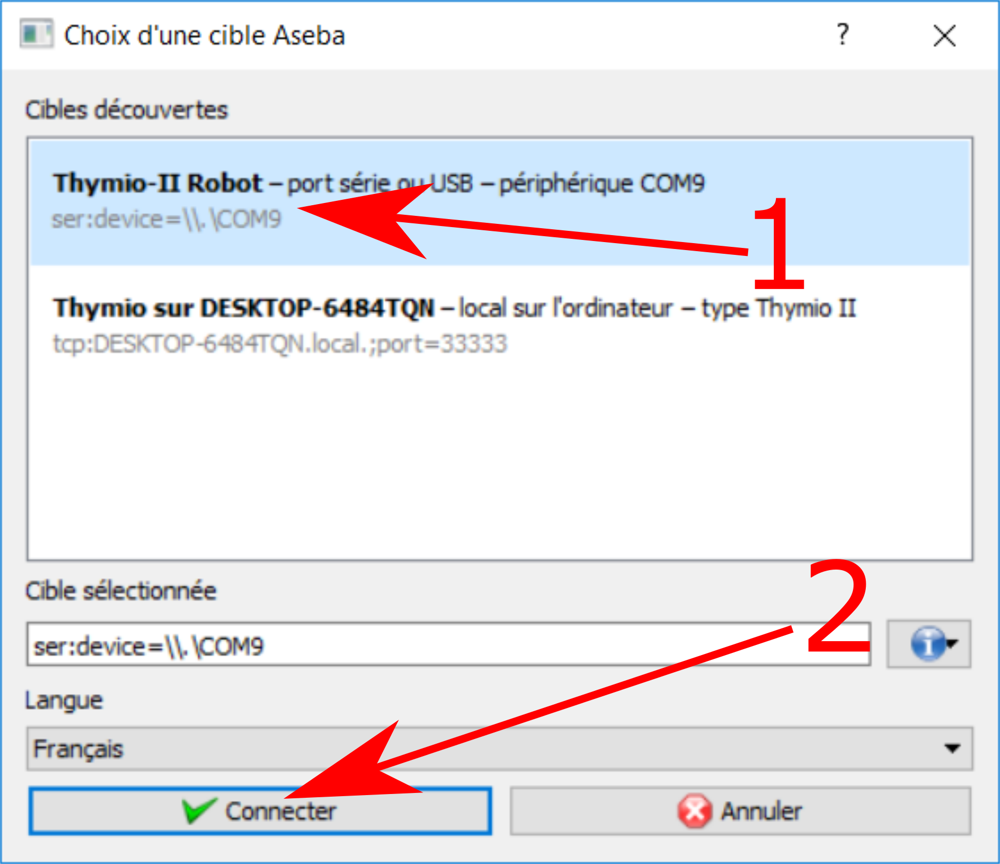
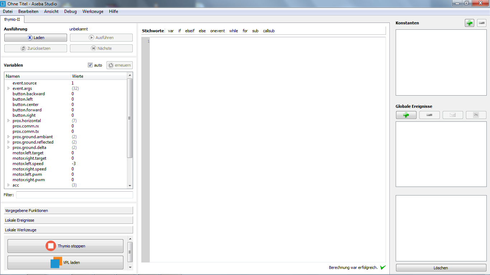

# 1. Thymio und Aseba


Ihr seid ab jetzt verantwortlich für einen Thymio-Roboter. 

* 🤖 Behandelt ihn pfleglich!
* 🔋 Ladet ihn am Ende jeder Stunde an der Ladestation auf.


Über den Bluetooth-Stick verbindet ihr den Thymio mit eurem Computer. Bluetooth ist ein in den 1990er Jahren ursprünglich von Ericsson entwickelter Industriestandard für die Funkvernetzung von Geräten über kurze Distanz. Bluetooth bildet dabei die Schnittstelle, über die sowohl mobile Kleingeräte wie Smartphones als auch Computer und Peripheriegeräte \(wie in unserem Fall der Thymio\) miteinander kommunizieren können. Hauptzweck von Bluetooth ist das Ersetzen von Kabelverbindungen zwischen Geräten.

Der Thymio kann nicht nur über die grafische Programmiersprache [VPL ](https://aseba.wdfiles.com/local--files/de:visualprogramming/thymio-vpl-ref-card-de.pdf)oder das blockbasierte [Scratch 3](https://scratch.mit.edu/projects/editor/?tutorial=getStarted) programmiert werden.

Als weitere Sprache kann Aseba verwendet werden. Die Syntax der Programmiersprache Aseba gleicht derjenigen von [Matlab](http://de.wikipedia.org/wiki/Matlab) \(verbreitete wissenschaftliche Programmiersprache\). Dies ermöglicht Programmierern mit Vorkenntnissen sich schnell zu orientieren und Aseba in Kürze zu erlernen. Semantisch gesehen, ist Aseba eine einfache, [imperative Programmierung](http://de.wikipedia.org/wiki/Imperative_Programmierung) mit einem einzelnen [Datentyp](http://de.wikipedia.org/wiki/Datentyp) \(16 [Bit](http://de.wikipedia.org/wiki/Bit) [Ganzzahlen](http://de.wikipedia.org/wiki/Integer_%28Datentyp%29) mit Vorzeichen\) und Vektoren davon. Diese Einfachheit erlaubt auch Programmierern ohne Vorkenntnisse [Mikrokontroller](http://de.wikipedia.org/wiki/Mikrocontroller)-basierte Roboter zu steuern.

Mit Aseba kann der Thymio ereignisgesteuert programmiert werden. Dieses digitale Buch führt Dich Schritt-für-Schritt in die Programmiersprache Aseba zur Programmierung des Thymio ein.

### Entdecke den Roboter Thymio und die Programmiersprache Aseba

Als erstes betrachtest Du den Roboter von nahem. Auf dem Roboter siehst Du mehrere Tasten. Indem Du den mittleren, runden Knopf lange drückst, kannst Du den Roboter einschalten. Mit den Pfeiltasten rund um die runde Knopf kannst du verschiedene, vorprogrammierte Verhaltensmuster auswählen.

Wenn Thymio nicht verbunden ist, oder falls Sie Aseba Studio starten \(nicht die Version "für Thymio"\), dann wird das nachfolgende Auswahlfenster erscheinen:

Die Programmieroberfläche von "Aseba Studio für Thymio" für textbasierte Programmierung sieht wie folgt aus:

